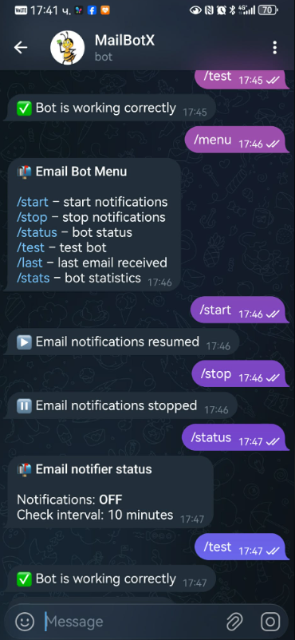

# MailBotX – Telegram Email Notifier

MailBotX is a **Telegram bot** that automatically sends **new Gmail emails** as notifications directly to your Telegram chat.

---

## 📌 Features

- Sends unread Gmail emails to Telegram
- HTML formatted messages with preview and timestamp
- Inline button linking to Gmail
- Commands: `/start`, `/stop`, `/status`, `/last`, `/stats`, `/test`, `/menu`

---
